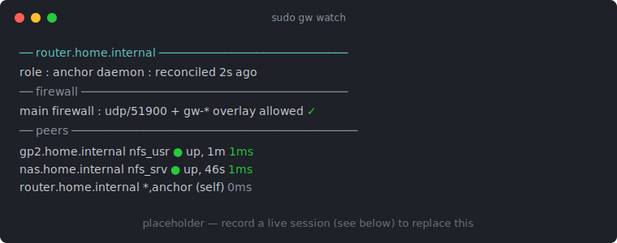

# Live dashboard — `gw watch`

`gw watch` is greasewood's live, in-terminal view of the mesh: the roster of
every node with its roles and credential expiry, the live WireGuard link state
and per-second throughput, an async latency column that fills in as pings
return, and a one-line firewall summary — all redrawing in place.

<!-- Replace assets/gw-watch.svg with a real recording (gif or svg); see below. -->
{ .gw-demo }

*(the image above is a static placeholder — [record a live session](#recording-the-demo) to replace it)*

## What you're looking at

Bare **`sudo gw`** in a terminal opens this view. Its layout, top to bottom:

- **A node header** — this box's identity, credential expiry, trust, and daemon
  freshness.
- **A firewall summary** — one line by default (press `f`, or `--firewall`, for
  the full host-rule check and greasewood's own nftables table). The host-
  firewall verdict stays verbatim, so a blocked port is as loud collapsed as
  expanded.
- **The peer roster** — the fleet on the left (name, address, roles, expiry),
  this node's view on the right (link state, rate, latency). Colored: `●` green
  for a live link, latency heat (green fast, yellow slow), loud red for
  `EXPIRED` / `BLOCKED`.

## Keys

| Key | Action |
|-----|--------|
| `↑↓` / `j` `k` | move the selection cursor |
| `PgUp/PgDn` `g` `G` | jump |
| `enter` | open the selected peer's detail panel |
| `f` | expand/collapse the firewall area |
| `t` | per-second rate ↔ cumulative traffic |
| `a` | show/hide expired peers |
| `r` | *(anchor, in panel)* edit a peer's roles |
| `x` | *(anchor, in panel)* revoke a peer |
| `?` | in-view help (keys + the everyday commands) |
| `q` | close a panel / quit |

On the anchor, selecting a peer and pressing `r` opens a **role editor** that
writes the declarative [`[assign]` table](access-control.md) and previews the
tunnel delta before applying; `x` opens a **revoke** flow gated by typing the
peer's hostname. On any node the panel is read-only.

For piping or logging, `gw watch --snapshot` prints a single static view (no
root, no terminal needed) with an everyday-commands index below it.

## Recording the demo

The recording above is best captured on a **real mesh** — the colors, latency,
and firewall summary are only meaningful with live nodes. On an anchor or node:

```bash
# 1. record a ~20s session (Ctrl-D or `exit` to stop)
asciinema rec gw-watch.cast --command "sudo gw watch" --idle-time-limit 2

# 2. convert to a GIF (agg = asciinema gif generator)
agg --theme monokai --font-size 16 gw-watch.cast gw-watch.gif

# 3. drop it in
cp gw-watch.gif docs/assets/gw-watch.gif
```

Prefer a crisper, smaller, text-selectable asset? `svg-term` renders the same
`.cast` to an animated SVG (`svg-term --in gw-watch.cast --out
docs/assets/gw-watch.svg`); point the image above at the `.svg` instead.
